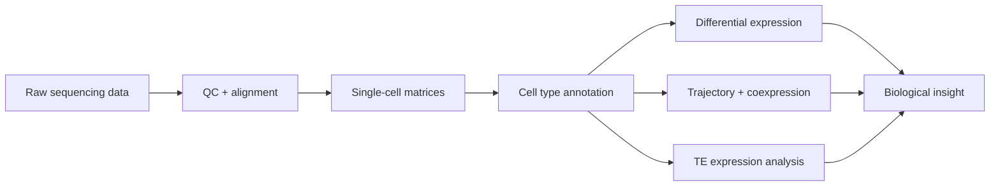

**PhD Candidate, Ecology & Evolutionary Biology — UC Irvine**
🧬 Ranz Lab · 🧪 Former Bioinformatics Intern, Zoetis

 

---

## About

I build computational workflows for understanding how genomes are regulated across cells, tissues, and evolutionary time. My research sits at the intersection of **single-cell genomics**, **evolutionary biology**, **transposable element (TE) biology**, and **chromatin regulation** — using high-dimensional sequencing data to resolve cell-type-specific gene expression and locus-level TE activity.

My dissertation focuses on the evolution of reproductive systems in *Drosophila*, spanning germline evolution, TE activity, and single-nucleus RNA-seq. It includes a first-author study published in *PLOS Biology*, with a second manuscript — on TE expression during spermatogenesis, supported by a gene-distance gradient model of H3K9me2 dynamics — currently in preparation.

---

## Current focus

<table>
<tr>
<td width="50%">

**Research**
- Single-cell and single-nucleus RNA-seq
- Comparative genomics across species and strains
- Germline gene regulation
- Transposable element expression
- Chromatin repression and H3K9me2 dynamics

</td>
<td width="50%">

**Building**
- Reproducible bioinformatics pipelines
- Locus-level TE analysis workflows
- Statistical models for genomic data
- Publication-quality visualizations
- Tools that make biological data easier to interpret

</td>
</tr>
</table>

---

## Areas of work

| Area | Focus |
|---|---|
| 🧫 **Single-cell genomics** | Cell type annotation, differential expression, pseudotime, compositional analysis, coexpression networks |
| 🧬 **Transposable elements** | Family-level and locus-resolved TE expression across germline development |
| 🧪 **Chromatin regulation** | CUT&Tag / ChIP-style signal analysis, chromatin compartments, repression marks |
| 🧠 **Computational biology** | Scalable workflows, statistical modeling, biological interpretation |
| 🤖 **AI + biology** | Tools that help scientists move from raw data to insight faster |

---

## Tech stack

**Languages**

**Bioinformatics & data**

**Workflow**

---

## Featured work

| Project | Description | Keywords |
|---|---|---|
| **Single-cell gonad atlas** | Comparative single-nucleus RNA-seq analysis of testis and ovary across *Drosophila* species and strains | `single-cell` `evolution` `reproductive biology` |
| **TE expression in spermatogenesis** | Locus-resolved analysis of transposable element activation across male germline development; manuscript in preparation | `transposable elements` `germline` `SoloTE` |
| **Chromatin repression dynamics** | Analysis of H3K9me2 redistribution and TE expression during meiosis, including a gene-distance gradient model | `epigenomics` `CUT&Tag` `H3K9me2` |
| **Bioinformatics workflows** | Reproducible Python/R pipelines for sequencing data processing, statistical analysis, and figure generation | `Python` `R` `HPC` `reproducibility` |

---

## How I approach science

> The best computational biology doesn't stop at generating results — it turns messy, high-dimensional data into a story that changes how we understand biology.

I aim for analyses that are:
- **Reproducible** enough for someone else to run
- **Statistically grounded** enough to trust
- **Biologically clear** enough to matter
- **Visualized well** enough to communicate

---

## Beyond the bench

- How AI can accelerate biological discovery
- Clear scientific communication and mentorship
- Building a research career that's rigorous, useful, and human

---

## Let's connect

Always happy to connect with people working on **genomics, single-cell biology, computational biology, bioinformatics, AI for science, or translational research.**

 

---

