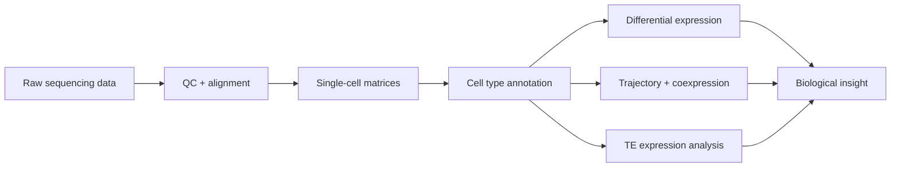

### 🧬 PhD Candidate @ UC Irvine · 🧪 Bioinformatics Intern @ Zoetis

### Turning genome-scale data into biological insight

 

---

## ⚡ What I do

I build computational workflows for understanding how genomes are regulated across cells, tissues, and evolutionary time.

My work sits at the intersection of **single-cell genomics**, **evolutionary biology**, **transposable element biology**, and **chromatin regulation**. I am especially interested in how high-dimensional sequencing data can reveal hidden structure in biological systems — from cell-type-specific gene expression to locus-resolved transposable element activation.

---

## 🧬 Current focus

<table>
<tr>
<td width="50%">

### 🔬 Research

* Single-cell and single-nucleus RNA-seq
* Comparative genomics across species and strains
* Germline gene regulation
* Transposable element expression
* Chromatin repression and H3K9me2 dynamics

</td>
<td width="50%">

### 🛠️ Building

* Reproducible bioinformatics pipelines
* Locus-level TE analysis workflows
* Statistical models for genomic data
* Publication-quality visualizations
* Tools that make biological data easier to interpret

</td>
</tr>
</table>

---

## 🧪 My scientific playground

| Area                         | What I work on                                                                                               |
| ---------------------------- | ------------------------------------------------------------------------------------------------------------ |
| 🧫 **Single-cell genomics**  | Cell type annotation, differential expression, pseudotime, compositional analysis, and coexpression networks |
| 🧬 **Transposable elements** | Family-level and locus-resolved TE expression across germline development                                    |
| 🧪 **Chromatin regulation**  | CUT&Tag / ChIP-style signal analysis, chromatin compartments, and repression marks                           |
| 🧠 **Computational biology** | Scalable workflows, statistical modeling, and biological interpretation                                      |
| 🤖 **AI + biology**          | Tools that help scientists move from raw data to insight faster                                              |

---

## 🛠️ Tech stack

### Languages

### Bioinformatics + data

### Workflow

---

## 🚀 Featured work

| Project                              | What it does                                                                                            | Keywords                                         |
| ------------------------------------ | ------------------------------------------------------------------------------------------------------- | ------------------------------------------------ |
| **Single-cell gonad atlas**          | Comparative single-nucleus RNA-seq analysis of testis and ovary across *Drosophila* species and strains | `single-cell` `evolution` `reproductive biology` |
| **TE expression in spermatogenesis** | Locus-resolved analysis of transposable element activation across male germline development             | `transposable elements` `germline` `SoloTE`      |
| **Chromatin repression dynamics**    | Analysis of H3K9me2 redistribution and TE expression during meiosis                                     | `epigenomics` `CUT&Tag` `H3K9me2`                |
| **Bioinformatics workflows**         | Reproducible pipelines for sequencing data processing, visualization, and statistical analysis          | `Python` `R` `HPC` `reproducibility`             |

---

## 🧠 How I think about science

> The best computational biology does not stop at generating results.
> It turns messy, high-dimensional data into a story that changes how we understand biology.

I care about analyses that are:

* **Reproducible** enough for someone else to run
* **Statistically grounded** enough to trust
* **Biologically clear** enough to matter
* **Visualized well** enough to communicate

---

## 🌌 Interests beyond the code

When I am not analyzing sequencing data, I am usually thinking about:

* How AI can accelerate biological discovery
* Better ways to explain complex science
* Mentorship, teaching, and scientific communication
* Building a research career that is rigorous, useful, and human

---

## 🤝 Let’s connect

I am always happy to connect with people working on
**genomics, single-cell biology, computational biology, bioinformatics, AI for science, or translational research.**

 

---

